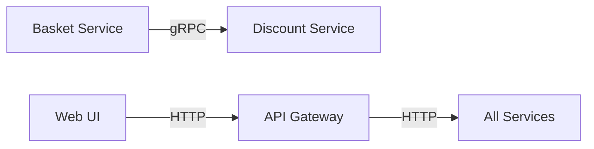
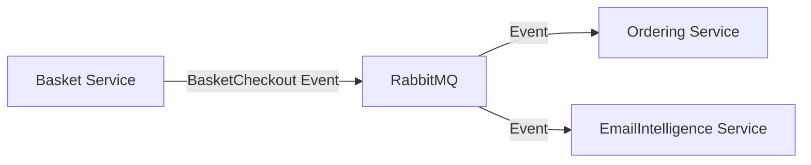

# 🏗️ Architecture Overview

This section contains comprehensive architecture documentation for the EShop Microservices platform.

## 📋 Architecture Documents

### 🎯 [EmailIntelligence Architecture Diagram](EmailIntelligence-Architecture-Diagram.html)
Interactive HTML diagram showing the complete EmailIntelligence service architecture including:
- Service components and layers
- Data flow and interactions
- External integrations (OpenAI, PostgreSQL, RabbitMQ)
- API endpoints and routing

### 🏛️ System Architecture

The EShop Microservices platform follows a distributed architecture pattern with the following core principles:

## 🔧 Architectural Patterns

### 🎯 **Microservices Architecture**
- **Service Independence**: Each service can be developed, deployed, and scaled independently
- **Domain-Driven Design**: Services are organized around business capabilities
- **Decentralized Data Management**: Each service owns its data and database
- **Fault Isolation**: Failure in one service doesn't cascade to others

### 📡 **Event-Driven Communication**
- **Asynchronous Messaging**: Services communicate via RabbitMQ message broker
- **Event Sourcing**: Critical business events are captured and stored
- **Saga Pattern**: Distributed transactions managed through choreography
- **Eventual Consistency**: Data consistency achieved over time across services

### 🚪 **API Gateway Pattern**
- **Single Entry Point**: YARP gateway provides unified API access
- **Cross-Cutting Concerns**: Authentication, logging, rate limiting at gateway
- **Service Discovery**: Dynamic routing to healthy service instances
- **Protocol Translation**: HTTP to gRPC translation when needed

## 🏗️ Service Architecture

### 🛍️ **Catalog Service**
```
📦 Catalog.API
├── 🎯 Minimal APIs (Carter)
├── 🏗️ Vertical Slice Architecture
├── 📋 CQRS with MediatR
├── 📊 PostgreSQL with Marten
└── 🔍 Health Checks
```

### 🧺 **Basket Service**
```
📦 Basket.API  
├── 🌐 REST API
├── ⚡ Redis Distributed Cache
├── 🔄 Cache-Aside Pattern
├── 📞 gRPC Client (Discount)
└── 📨 RabbitMQ Publisher
```

### 💰 **Discount Service**
```
📦 Discount.gRPC
├── ⚡ High-Performance gRPC
├── 📊 SQLite with EF Core
├── 🔄 Database Migrations
└── 📋 Protobuf Contracts
```

### 📦 **Ordering Service**
```
📦 Ordering.API
├── 🏗️ Clean Architecture
├── 📋 CQRS with MediatR
├── 🎯 Domain-Driven Design
├── 📊 SQL Server with EF Core
└── 📨 RabbitMQ Consumer
```

### 🧠 **EmailIntelligence Service**
```
📦 EmailIntelligence.API
├── 🏗️ Clean Architecture
├── 📋 CQRS with MediatR
├── 🤖 OpenAI Integration
├── 📊 PostgreSQL with EF Core
└── 📨 RabbitMQ Integration
```

## 🗄️ Data Architecture

### **Database Per Service**
- **Catalog**: PostgreSQL (Document-oriented with Marten)
- **Basket**: Redis (Key-Value cache) + PostgreSQL (Persistent storage)
- **Discount**: SQLite (Lightweight relational)
- **Ordering**: SQL Server (Complex relational with transactions)
- **EmailIntelligence**: PostgreSQL (Relational with JSON support)

### **Data Consistency Strategies**
- **Strong Consistency**: Within service boundaries
- **Eventual Consistency**: Across service boundaries via events
- **Distributed Transactions**: Saga pattern for complex workflows
- **Data Synchronization**: Event-driven updates between services

## 🌐 Communication Patterns

### **Synchronous Communication**


### **Asynchronous Communication**


## 🔒 Security Architecture

### **Authentication & Authorization**
- **API Gateway**: Centralized authentication point
- **JWT Tokens**: Stateless authentication across services
- **Service-to-Service**: Mutual TLS or service mesh
- **API Keys**: External service integration (OpenAI)

### **Data Protection**
- **Encryption at Rest**: Database encryption
- **Encryption in Transit**: HTTPS/TLS everywhere
- **Secrets Management**: Environment variables and key vaults
- **Input Validation**: Request validation at service boundaries

## 🚀 Deployment Architecture

### **Containerization**
```
🐳 Docker Containers
├── 📦 Application Services
├── 🗄️ Database Services  
├── 📨 Message Broker
└── 🌐 Reverse Proxy/Gateway
```

### **Orchestration**
- **Development**: Docker Compose
- **Production**: Kubernetes or Azure Container Apps
- **Service Discovery**: Built-in container networking
- **Load Balancing**: Gateway-level and container-level

## 📊 Monitoring & Observability

### **Health Monitoring**
- Service health endpoints
- Database connection checks
- External dependency validation
- Resource utilization tracking

### **Logging Strategy**
- Structured logging (JSON)
- Correlation IDs for request tracing
- Centralized log aggregation
- Error alerting and notifications

### **Metrics Collection**
- Performance counters
- Business metrics
- Infrastructure metrics
- Custom application metrics

## 🔧 Development Architecture

### **Code Organization**
```
📁 src/
├── 📁 Services/           # Business services
├── 📁 BuildingBlocks/     # Shared libraries
├── 📁 ApiGateways/        # Gateway services
├── 📁 WebApps/           # Web applications
└── 📄 docker-compose.*   # Container orchestration
```

### **Technology Stack**
- **.NET 8**: Latest framework features
- **C# 12**: Modern language capabilities
- **Minimal APIs**: Lightweight service endpoints
- **Entity Framework Core**: ORM with migrations
- **MediatR**: CQRS and mediator patterns
- **Carter**: Minimal API framework
- **YARP**: Reverse proxy and gateway
- **Docker**: Containerization platform

This architecture provides a scalable, maintainable, and resilient e-commerce platform that can handle complex business requirements while maintaining service independence and operational excellence.
